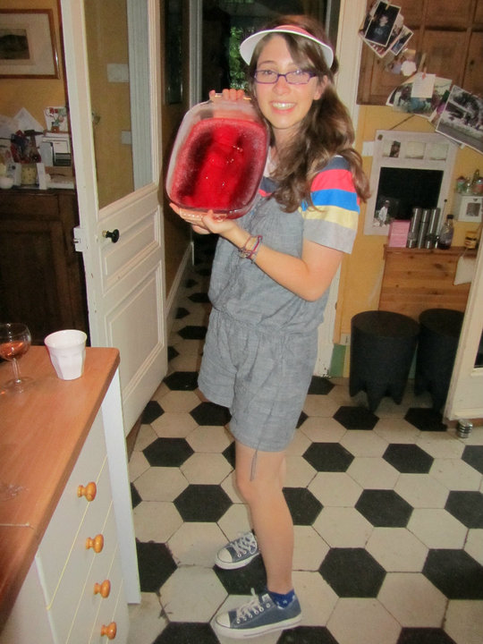

## Hello, nice to meet you :)

The rumors are true: This is my fourth blog, fifth if we're including my Xanga (R.I.P. 2002-2005).

...

My last three blogs were kept primarily to satiate my family's desire for proof that I was ~~surviving~~ thriving while living abroad. They detailed my quotidienne existence as I did embarrassing things in unfamiliar places such as chasing down the final midnight bus for 20 blocks with an open pan of Jell-o underarm or, accidentally inviting myself to a stranger's family-only birthday party at a bowling alley. The posts served as reassurance to both me and my beloved, that things were _more-or-less fine_.

###### _Me, posing with the infamous jell-o tray hours before the bus catastrophe. Are you wondering why I was wearing a foam visor in 2010? Me too._

None of those blogs exist anymore, which is probably for the best. And while the great quarantine of 2020 kept me from getting myself into situational trouble with the outside world, it did push me toward an entirely different kind of adventure: **web development**.

...

That's right. In my third decade of life, I've decided it's high time to make a career shift -- because -- what fun is life without a little adventure?

With a new year (huzzah!)...

The newish decade (roaring twenties 2.0)...

And my new career (computer whisperer)...

Please allow me to present you with: **a new blog**.

...

While I won't be writing about awkward encounters with humans anymore, I'm sure I'll have plenty to document about my interactions with computers. If that interests you, please join along for the ride!

## Cool, Jennifer. We get it. You have a lot to say! But what exactly will you be blogging about?

- My experience transitioning my career to web development from a non-technical background

- The inside scoop about what it's like to complete a full-stack web-development bootcamp

- Updates and insights from projects I'm working on

- Short tutorials about the things I've learned

- etc...

I'm sure as I continue to grow, learn, and experience new things, I will have plenty more topics to cover. Sky's the limit!

## Nice! What's your motivation for doing this?

There are many reasons I want to record my experiences, but here are a few:

### SHARING IS CARING

I have learned so much from other people's blogs. Truly.

You know in coding, how _they_ always say: "READ THE DOCUMENTATION" ? Well, it's sound advice. You should totally do it. But sometimes the documentation lacks the context I'm looking for and I need a human to explain to me like I'm five _why_ I'm supposed to do something with an example that's more layered than "hello world" (or, you get the gist).

Blog posts are a powerful tool for boosting understanding of how a developer might use a certain kind of tech in the wild. Admittedly, I am still green. Even so, my hope is that I can provide a proverbial life boat to new learners, as so many others have done, and continue to do, for me.

...

### WHEN I WRITE, I LEARN.

Everyone learns differently and has their preferences.

My preference?

1. Research
2. Experiment
3. Reflect on the outcome
4. Rinse. Refine. Repeat.

When I rush through a project -- web development or otherwise -- it's not unusual for me to forget how I've done it. However, when I take the time to verbalize my process, I'm far more likely to reuse, sharpen, and build upon those skills moving forward. Explaining the steps and logic of getting from point A to point B is an excellent way to reinforce knowledge.

Writing helps me. It's a meditation of sorts.

And, I see your point. I could write in a private journal and achieve the same goal. However, I believe that learning should be accessible for everyone. In the spirit of accessibility, the web-dev portion of my brain is an open book and you can partake in its musings if doing so suits you.

...

### REPRESENTATION

Growing up, nobody was actively encouraging me to do anything STEM (science, technology, engineering and mathematics) related. It's not like I was being discouraged per se, but I had no idea what the career options were and I didn't realize I was even capable. Adults in my life lovingly nurtured my creativity and kindness, but neglected to encourage my critical thinking and problem solving abilities.

I want to believe (X-Files pun not intended but noted nonetheless) the tides are changing toward equality for females and non-binary indivuduals but the reality is, social norms are a hell of a drug and deconstructing gender biases is an uphill battle.

Of course, I'm simplifying a complex topic because there are so many other layers in addition  to gender that define how the world perceives people. And there's even more nuance within the context of tech. I'm not going to deep-dive at the moment, so let's suffice it to say I am writing publicly because I want everyone to know that regardless of your social identity and/or upbringing : **computer programming / STEM is for you if that's what you want**.

May this tiny corner of the internet inspire someone who never knew they could.

...

### CONNECTION

If there's one thing I love, it's making new friends and learning about people.

If something I write about resonnates with you or tickles your fancy, please reach out! I want to hear from you!

...

### LAUGHING FEELS BETTER THAN CRYING

At the very least, I hope you can laugh with me. Obtaining new skills is a challenge and sometimes things get weird. Although it's tempting to indulge imposter syndrome when things get tough, it's important to remember that everyone makes mistakes. I promise to be transparent with you about my triumphs and tribulations and in exchange, I hope you'll continue to be brave, bold, and willing to try new things.

...

**Remember: there's no shame in learning!**

Cheers to acquiring new skills and knowledge in 2021!
